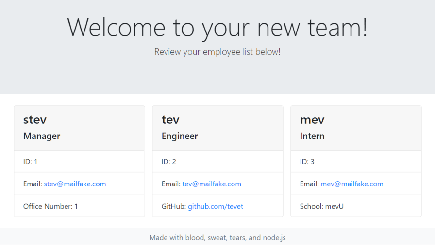
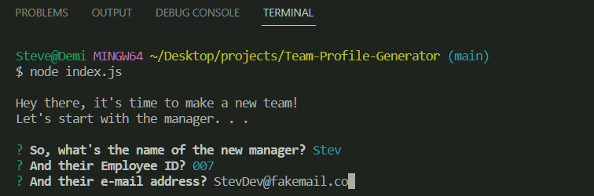

# Team Profile Generator

## Table of Contents
* [Description](#description)
* [Installation](#installation)
* [Usage](#usage)
* [License](#license)
* [Contributing](#contributing)
* [Tests](#tests)
* [Questions](#questions)

## Description

The Team Profile Generator is a command line program that uses node.js and the inquirer npm package to create an HTML page with contact info for your team!

## Installation

Follow the below steps to install the program:

    npm install

## Usage

To use the Team Profile Generator, just clone the repository, install the relevant npm files, and run the following code in your console:

    node index.js

The program will prompt you through the rest, just answer the questions and you'll have a working index.html file full of your team's contact info!

You can watch a demo of the program in action [here!](https://watch.screencastify.com/v/mchD1cYPOJ9EFvIudMjX)

## License

This project uses the following license: 

    MIT license

Click the badge to access the full license details.

## Contributing

N/A

## Tests

Follow the below steps to test the program:

    npm test

## Questions

For more information, feel free to contact me:

GitHub: [github.com/stevengoldbergm](https://github.com/stevengoldbergm)

